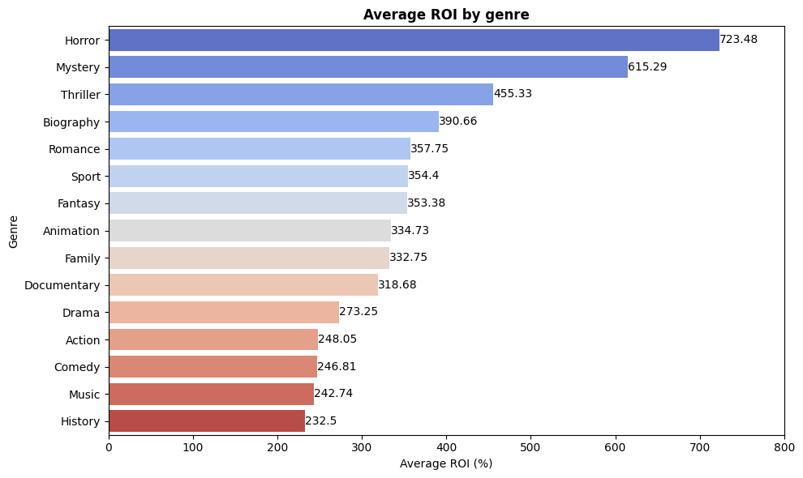
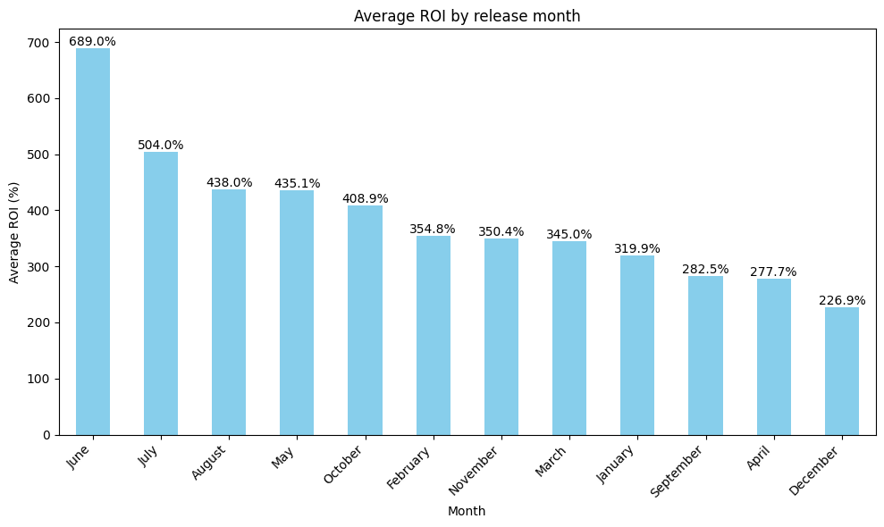
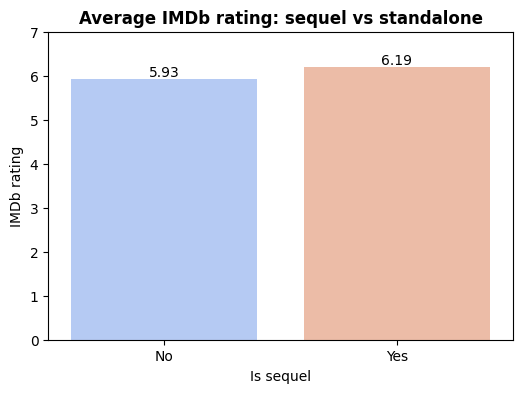
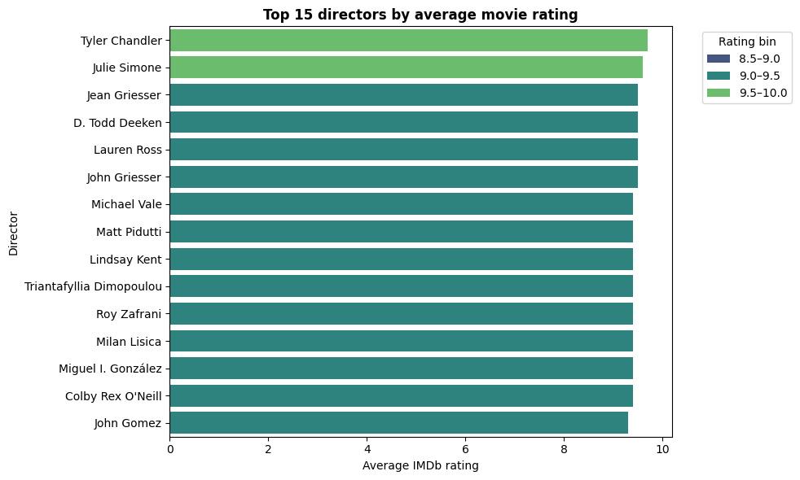
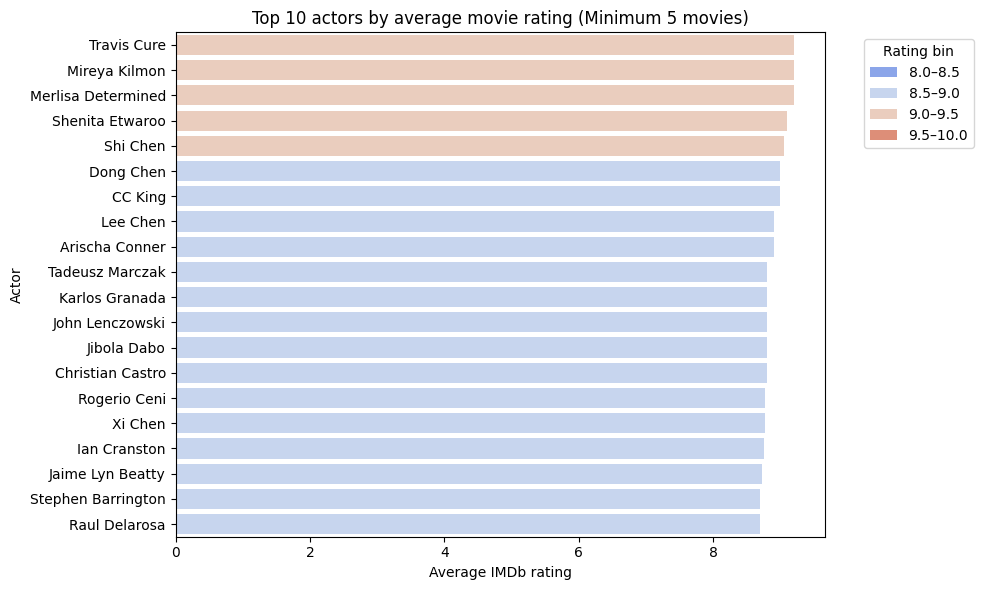
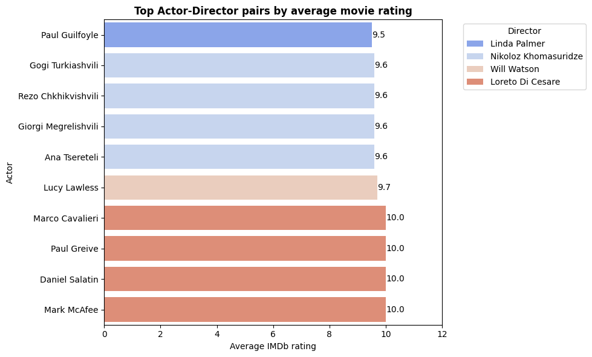
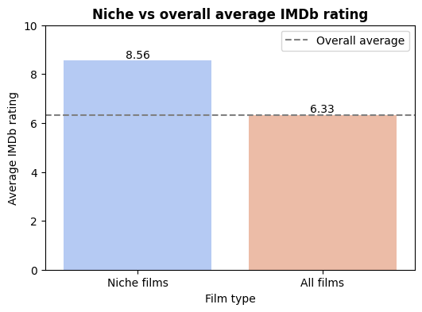
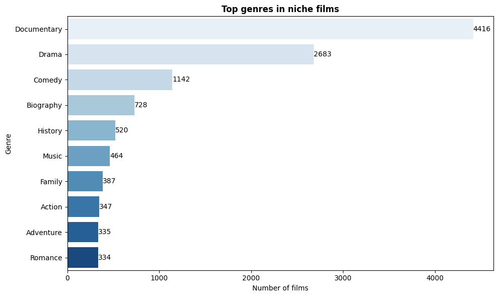
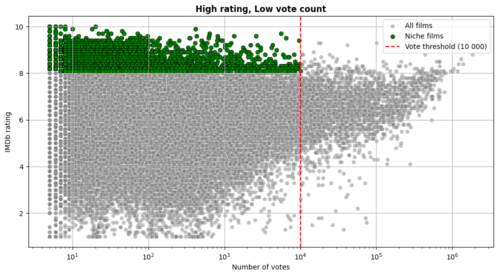
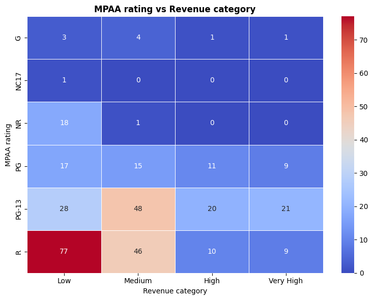

# Movie Studio Insights Project

## Overview
In today’s entertainment landscape, original video content has become a critical driver of success for major companies. With streaming platforms and traditional studios investing heavily in film production, the market is more competitive than ever. This company has decided to enter this space by launching a new movie studio but lacks the internal knowledge and historical data to make informed decisions about what types of films to produce.

This project provides data-driven insights to support the strategic launch of a new movie studio. The analysis of historical movie performance data across genres, financial returns, talent partnerships, release timing, and audience reception, helps identify key trends and opportunities in the competitive entertainment industry.

The insights generated from this project aim to guide decision-making in content selection, budget allocation, marketing strategy, and franchise development.

## Business problem

With the entertainment industry increasingly dominated by companies producing original content, this company aims to enter the space by launching a new movie studio. However, as a newcomer, it lacks historical insight into what types of films are most likely to succeed both critically and financially. As the data analyst on this project, I am tasked with conducting exploratory data analysis (EDA) to uncover patterns, trends, and correlations in movie performance data. I will then translate those findings into actionable business insights that the head of the new movie studio can use to guide strategic decisions around:
- Genre selection
- Release timing
- Talent acquisition (directors, actors)
- Budget allocation
- Franchise opportunities (sequels)
- Audience targeting (MPAA ratings)

### Goal
The primary objective is to uncover meaningful trends and patterns in film performance, including genre popularity, audience ratings, financial returns, and seasonal influences, to help the new studio make strategic content decisions. The goal is to build a strong foundation for selecting and developing film projects that balance artistic value with commercial potential, ultimately maximizing return on investment, audience engagement, and long-term brand credibility in a highly competitive industry.

### Stakeholders
Several key groups will rely on the insights generated from this analysis to guide the studio’s operations and strategic direction. Studio executives and producers will use the findings to evaluate and approve film projects while minimizing financial risk. Marketing and distribution teams will apply the data to design more effective promotional strategies and optimize release schedules for broader audience reach. Creative leaders, including directors and writers, will benefit from understanding which genres and themes have a stronger likelihood of success, allowing them to align their creative efforts with market demand. Investors and shareholders will look to the analysis to assess the viability of the studio’s business model and its long-term growth prospects.

### Key questions
1. What genres yield the highest return on investment (ROI)?
2. When is the best time to release movies for maximum financial returns?
3. Do sequels perform better than standalone films?
4. Which directors and actors consistently deliver high-quality films?
5. Are there opportunities in niche or under-the-radar films?
6. How does MPAA rating affect a film’s financial performance?

## Data understanding
### Data sources
This project draws from multiple external platforms and databases to provide a comprehensive view of the movie industry from financial performance to audience ratings and creative talent. Each dataset contributes unique insights into different aspects of film performance, audience reception, financial returns, and creative talent.

1. The Numbers (TN) : Provides financial insights into movie production and performance, including production budgets and gross earnings.
2. Box Office Mojo (BOM) : Contains financial performance data for movies, including domestic and foreign gross revenue broken down by studio.
3. The Movie Database (TMDB) : Offers information about movies, including details like movie titles, release years, popularity scores, and vote counts.
4. Rotten Tomatoes (RT) : Includes information on movie reviews, ratings, and box office performance.
5. IMDb : A relational SQLite database containing detailed information about movies, including titles, genres, directors, actors, and ratings.

### Data cleaning
The data cleaning process was guided by insights gained during the data understanding stage. Missing values were handled based on their impact on analysis. Missing studio names were filled with 'Unknown', while rows with missing critical financial data were dropped. In some datasets, missing values were removed if they were not critical to the analysis. Additionally, currency fields were cleaned and converted to numeric values for consistency.

### Structure of the datasets
Each dataset was structured to provide specific insights:

1. The Numbers (TN) : Includes columns such as movie, release_date, production_budget, domestic_gross, and worldwide_gross.
2. Box Office Mojo (BOM) : Contains columns like title, studio, domestic_gross, and foreign_gross.
3. The Movie Database (TMDB) : Includes columns such as title, release_date, popularity, and vote_count.
4. Rotten Tomatoes (RT) : Contains information about movie reviews, ratings, and box office performance.
5. IMDb : Provides metadata about movies, including genres, directors, actors, and ratings.

## Visualizations
### Average ROI by genre

`Horror` has the highest average ROI at 723.48%, indicating that horror films, on average, provide the best return on investment. This is followed by `Mystery` (615.29%) and `Thriller` (455.33%), suggesting that suspenseful and enigmatic narratives can also be highly profitable. `Action`, `Comedy`, and `Drama` also show respectable ROIs but are lower compared to the top performers, implying that while popular, they may require careful budgeting to achieve comparable ROI. `History` has the lowest average ROI of this top 15 at 232.5%, suggesting it may not be as financially viable as other genres, and the studio should approach this genre with caution.

### Average ROI by release month

The analysis of average ROI by release month reveals clear seasonal trends in movie profitability. `June` stands out with the highest average ROI at 689.0%, indicating that films released during this month tend to generate significantly greater returns compared to other months. This is closely followed by `July`, which also shows a strong ROI of 504.0%. Both months coincide with the traditional summer blockbuster season, a period when studios strategically release major films to capitalize on school breaks and increased audience turnout. 

In addition to the summer months, `May` and `October` also demonstrate relatively high ROIs (435.1% and 408.9%, respectively), making them attractive windows for film releases. Conversely, `January` and `December` have the lowest average ROIs (282.5% and 226.9%), likely due to heightened competition from holiday releases and potentially lower audience engagement. Timing does play quite an important role in maximizing financial returns, and the studio may benefit from aligning their release strategies with periods of historically higher ROI.

### Average IMDb rating: sequel vs standalone

Sequels tend to receive higher average IMDb ratings (6.19) compared to standalone films (5.93), suggesting that, on average, they are viewed more positively by audiences. This pattern may be driven by the presence of an established fan base, as well as the built-in anticipation that comes with continuing a known story. Viewers who are already invested in characters and plotlines are more likely to engage with and appreciate follow-up films, contributing to the overall boost in ratings.

For the new studio, this trend highlights the potential benefits of investing in sequels or franchise-driven content. The advantage of existing brand recognition can lead to stronger initial reception and audience loyalty. However, this strategy should be weighed against factors such as production costs, creative sustainability, and the risk of oversaturation. Rather than relying solely on sequels, a balanced approach combining franchise development with innovative standalone projects can help maintain both artistic diversity and financial stability.

### Director and Actors
#### Top 15 directors by average movie rating

Several directors, including Tyler Chandler and Julie Simone, maintain exceptionally high average IMDb ratings within the `9.5–10.0` range, suggesting a consistent ability to deliver films that receive widespread critical acclaim. Others, such as Jean Griesser and D. Todd Deeken, fall just below in the `9.0–9.5` range, still reflecting a strong track record of quality filmmaking, though slightly less consistent at the highest level. These distinctions highlight the varying degrees of directorial impact on audience and critic reception.

For a new studio, the opportunity lies in leveraging this performance data to shape talent acquisition and creative direction. Directors in the top tier offer a proven ability to generate high-quality content that resonates with audiences, making them valuable partners for projects aiming to build prestige. At the same time, those in the second tier represent a pool of rising talent that, with the right support and resources, could develop into top-tier contributors. Establishing partnerships with filmmakers who align with your studio’s vision, whether established or emerging, can help build a strong brand identity centered on quality and critical recognition. This approach not only enhances the likelihood of producing well-received films but also strengthens the studio’s reputation over time.

#### Top actors by average movie rating (Minimum 5 Movies)

Actors with consistently high IMDb ratings, including Travis Cure, Mireya Kilmon, and Merlisa Determined, all of whom fall within the 9.0–9.5 or 9.5–10.0 rating ranges, indicating a strong track record of critical acclaim across multiple films. While these top performers stand out, many other actors show ratings clustered in the 8.5–9.0 range, reflecting solid and dependable performances, though slightly below the highest tier. The use of color-coded rating bins helps illustrate how actors are distributed across different levels of audience reception. To ensure statistical relevance, the chart only includes actors with at least five film appearances, providing a reliable basis for evaluating their overall performance and popularity.

#### Top Actor-Director pairs by average movie rating

Certain actor-director partnerships, such as those featuring Paul Guilfoyle, Gogi Turkiashvili, and Mark McAfee, consistently achieve exceptionally high IMDb ratings, often in the 9.5–10.0 range. These pairings demonstrate a strong creative synergy that leads to the production of critically acclaimed films. The repeated success of these collaborations underscores the impact of strong working relationships in the filmmaking process.

For a new studio, the data provides a clear direction for strategic decision-making. Collaborations between actors and directors with a history of high ratings should be a priority, as they are linked to quality outcomes and audience approval. Examples such as Linda Palmer and Paul Guilfoyle or Loreto Di Cesare and Mark McAfee illustrate the potential for excellence when proven talents work together. At the same time, emerging partnerships involving directors like Nikoloz Khomasuridze and Will Watson show early promise and may represent valuable opportunities for growth and development.

### Opportunities in niche or under-the-radar films
#### Niche vs Overall average IMDb rating

This analysis compares the average IMDb ratings of niche films to the overall average IMDb rating across all films. The chart highlights important differences in audience reception between these two groups. Niche films, represented by the blue bar, have an average IMDb rating of 8.56, which is significantly higher than the overall average of 6.33 shown by the orange bar. Despite limited visibility and lower vote counts, niche films receive strong critical acclaim from viewers. These films often feature unique themes, genres, or storytelling styles that resonate deeply with specific audiences. The results suggest that niche films offer a higher quality-to-popularity ratio compared to mainstream releases.

#### Top genres in niche films

This analysis identifies a set of highly rated but under-the-radar films that have received strong audience approval (IMDb rating > 8) but have not reached mainstream visibility, as indicated by their relatively low vote counts (<10,000). These niche films include documentaries, dramas, and biographical stories that often explore unique or culturally rich themes. Despite their limited reach, these films maintain a strong average rating, suggesting that they resonate deeply with the audiences who do watch them. Examples include titles like The Act of Killing and Searching for Sugar Man, which are critically acclaimed yet commercially modest, reinforcing the idea that quality does not always equate to popularity.

The findings suggest that a new movie studio can find opportunity in these underrated but impactful films by targeting passionate audience segments through streaming platforms, film festivals, or limited theatrical releases. These films often require lower production budgets, making them ideal for cost-effective, high-impact storytelling. By focusing on genres like documentary, biography, and history, the studio can differentiate itself in a market dominated by high-budget blockbusters. This strategy allows for brand building, audience loyalty, and creative freedom, all while minimizing financial risk. Investing in niche content could lead to long-term success by cultivating a dedicated fanbase that values authenticity, originality, and emotional resonance.

#### High rating, Low vote count 

The green dots representing niche films illustrate a distinct group of movies with exceptionally high IMDb ratings but relatively low vote counts, indicating that while these films are critically acclaimed, they have not reached a wide audience. This suggests that they are underrated in terms of visibility, and could benefit from targeted marketing efforts or strategic re-releases to increase their impact.

There is a growing opportunity for the studio to focus on niche films, which often fall into genres such as documentary, biography, and historical drama categories that appear frequently among high-rated, low-visibility films. These films typically require lower production budgets, making them ideal for cost-effective, high-impact projects. By investing in similar content, the studio can engage passionate audience segments, build brand loyalty, and establish a reputation for quality-driven, innovative storytelling that stands out from mainstream competition.

### MPAA rating vs revenue category

This heatmap illustrates how MPAA ratings (G, NC-17, NR, PG, PG-13, R) relate to different revenue categories (Low, Medium, High, Very High). The color intensity in each cell reflects the number of films that fall into a specific rating and revenue combination. 

R-rated films appear most frequently across all revenue levels, especially in the Medium and Very High categories. For instance, R-rated films in the Medium revenue group total 46, making them the most common among high-revenue films. PG-13 films also show strong performance, particularly in the Medium and High revenue ranges. PG-13 movies are widely distributed and found across all revenue tiers, with the highest count of 48 in the Medium category. This suggests that PG-13 films are able to reach a wide audience and consistently achieve moderate to strong financial results. In contrast, G-rated films are mostly found in the Low revenue category, pointing to a more limited audience appeal. NC-17 films have very low numbers across all revenue levels, indicating minimal market presence or acceptance. NR films show a moderate presence, appearing in both the Medium and Very High revenue categories. PG-rated films also demonstrate moderate success, with notable representation in the Medium and High revenue groups, showing they can perform reasonably well at the box office.

## Key findings
The analysis of the movie industry data reveals several important patterns and trends that can guide strategic decision-making for a new movie studio. These insights cover financial performance, genre preferences, release timing, talent selection, and niche market opportunities.

One of the most significant observations is the strong financial performance of fiction films compared to real-life films. On average, fiction films generate a much higher return on investment and worldwide gross revenue. This suggests that fictional narratives tend to attract broader audiences and perform better globally, likely due to their wider appeal and more extensive marketing and distribution strategies.

Genre plays a role in both financial success and audience reception. Horror films, for example, show the highest average ROI, followed by Mystery and Thriller genres. These findings indicate that suspense-driven or genre-specific storytelling can be highly profitable, especially when produced with lower budgets. In contrast, historical films have the lowest average ROI, suggesting they may require more careful planning and targeted marketing to succeed.

The timing of a film’s release also has a clear impact on its financial performance. June and July are the most profitable months for releases, aligning with the traditional summer blockbuster season. May and October also show relatively high ROI, making them attractive windows for film releases. Conversely, January and December have the lowest average ROI, possibly due to increased competition during the holiday season or lower audience engagement during those months.

MPAA ratings also influence a film’s financial performance. R-rated films dominate the high-revenue categories, particularly in the medium and very high revenue tiers. PG-13 films are widely distributed and consistently achieve moderate to strong financial results, making them a reliable choice for studios aiming to reach a broad audience. G-rated films, on the other hand, are mostly found in the low-revenue category, indicating limited audience reach or commercial viability.

Talent selection is another key factor in film success. Several directors, including Tyler Chandler and Julie Simone, maintain exceptionally high average IMDb ratings, suggesting a consistent ability to deliver critically acclaimed films. Actors such as Travis Cure, Mireya Kilmon, and Merlisa Determined also demonstrate strong performance across multiple films. Additionally, certain actor-director partnerships, such as those involving Paul Guilfoyle and Mark McAfee, consistently achieve high ratings, highlighting the importance of creative synergy in filmmaking.

Sequels tend to receive higher average IMDb ratings compared to standalone films. This may be due to the presence of an established fan base and built-in anticipation from previous installments. However, sequels also come with higher production costs and potential market saturation, so a balanced approach that includes both franchise-driven content and original projects is recommended.

Niche films represent an often-overlooked opportunity. These films, which include documentaries, dramas, and biographical stories, often explore unique or culturally rich themes. Despite their limited reach, they maintain strong average ratings, suggesting they resonate deeply with the audiences who do watch them. Investing in niche content could allow a new studio to differentiate itself in a market dominated by high-budget blockbusters while minimizing financial risk.

Finally, there is a positive correlation between a film’s popularity and its worldwide gross revenue, indicating that films that generate more attention and engagement tend to perform better financially. However, some films deviate from this trend, showing that popularity and revenue do not always align. This highlights the complex factors that influence a film’s financial success beyond audience engagement metrics, such as marketing strategy, genre, and release timing.

## Recommendations
#### Focus on high-ROI genres
1. Prioritize Horror, Mystery, and Thriller films

The analysis of Return on Investment (ROI) by genre revealed that Horror films have the highest average ROI at 723.48%, followed by Mystery (615.29%) and Thriller (455.33%). These genres consistently outperform others in terms of financial returns, making them ideal candidates for investment.

- Horror films, on average, provide the best return on investment.
- Even with low budgets, films like Paranormal Activity achieved ROI of over 43,000%, showing that low-cost, genre-driven content can yield massive profits.

The new studio should allocate a significant portion of its production slate to these genres. Horror, in particular, offers a strong balance between low production costs and high audience engagement, making it a financially sound starting point. This strategy allows the studio to build a profitable foundation while minimizing financial risk.

#### Leverage seasonal release timing
2. Target Summer and Christmas for maximum ROI

The data shows a strong correlation between release timing and financial performance. Films released during Summer and Christmas consistently achieve higher average ROI and worldwide gross.

- The Summer season has the highest median worldwide gross, exceeding $250 million, and is dominated by blockbuster releases.
- Christmas is the most successful period across nearly all genres, especially for Drama, Comedy, and Family films.
- Sequels and original films both perform well during Christmas, indicating broad audience appeal during this period.

The studio should strategically plan its release calendar to align with these high-performing seasons. Summer is ideal for high-concept, original films, while Christmas offers a prime window for emotionally resonant or family-oriented content. This timing strategy enhances visibility, audience turnout, and marketing effectiveness.

#### Invest in sequels and franchise development
3. Leverage existing audience loyalty

Sequels tend to receive higher average IMDb ratings (6.19) compared to standalone films (5.93), and they benefit from built-in audience anticipation and brand recognition.

- Sequels are viewed more favorably by audiences, likely due to established fan bases.
- Sequels perform especially well during Valentine’s Day and Thanksgiving, when competition from original blockbusters is lower.
- Original films dominate the Summer season, but sequels can capitalize on other high-engagement periods.

The studio should consider developing sequels or acquiring rights to existing intellectual property (IP) to build a franchise-driven business model. Sequels reduce marketing risk and offer more predictable returns, which is quite important for a new entrant in a competitive market. A balanced approach mixing sequels with carefully selected original content can help build brand recognition while ensuring financial stability.

## Conclusion
The analysis of movie performance data reveals several key insights that can guide a new studio in making informed, data-driven decisions. Financial success is strongly influenced by genre selection, release timing, and the balance between original and sequel content. Horror, Mystery, and Thriller films consistently deliver the highest average ROI, while summer and Christmas emerge as the most lucrative release periods. Additionally, sequels tend to receive higher audience ratings, suggesting that franchise development can enhance both critical reception and audience loyalty. These findings emphasize the importance of strategic planning in content creation, marketing, and distribution to maximize returns and brand recognition.

Beyond the key findings, the data also highlights opportunities in niche and under-the-radar films that, while not widely seen, maintain high IMDb ratings. These films often require lower budgets and can appeal to passionate, dedicated audiences through targeted releases and streaming platforms. Understanding the dynamics of MPAA ratings, audience engagement, and seasonal trends provides a competitive edge, especially for a new entrant in a saturated market. By combining financial insight with creative strategy, the studio can build a diverse and profitable film portfolio that resonates with both critics and viewers.

## Next steps
1. Deep dive into audience demographics and genre preferences

While the current analysis identifies high-performing genres and seasonal trends, a more detailed exploration of audience demographics could provide crucial insights into who is watching which genres and why certain films resonate more with specific groups. This could involve:
- Merging datasets with audience survey data or streaming platform analytics (if available).
- Analyzing how MPAA ratings correlate with audience engagement across different age groups.
- Investigating regional preferences to identify underexplored international markets.
This level of insight would allow the studio to tailor marketing strategies, optimize casting and storytelling choices, and target specific platforms or release windows to maximize audience engagement.

2. Sentiment and text analysis of reviews

The current analysis includes data from Rotten Tomatoes and IMDb ratings but stops short of performing natural language processing (NLP) on movie reviews or audience comments. Conducting a sentiment analysis or topic modeling on textual reviews could uncover:
- What specific aspects of a film (e.g., acting, plot, visuals) drive positive or negative sentiment.
- Common themes or emotional drivers that make certain genres or directors more appealing.
- How critical reviews compare with audience opinions and how that affects a film’s performance.
This would provide a deeper understanding of audience perception, enabling the studio to improve script development, fine-tune creative decisions, and craft messaging that aligns with audience expectations.

3. Predictive modeling for film success

To move beyond descriptive analysis and into actionable forecasting, the next logical step is to build predictive models that estimate the likelihood of a film’s financial and critical success. This approach would allow the studio to evaluate potential projects before production, allocate budgets more effectively, and reduce the risk of underperforming films, giving it a competitive edge in decision-making.
